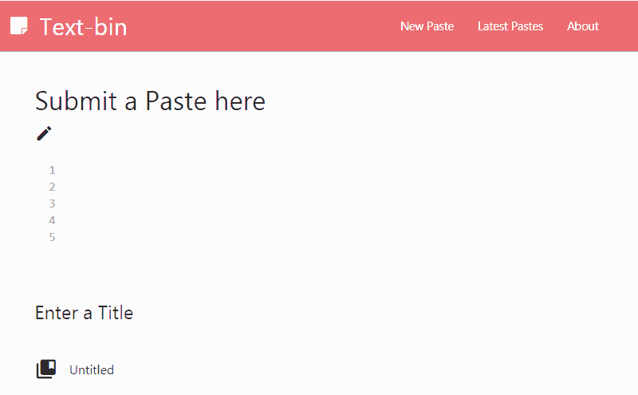

# text-bin-nodejs
An implementation similar to that of Pastebin and other text storage websites, in Nodejs and Express. Uses MongoDB as database. 



### Tech Stack

 - node.js - evented I/O for the backend
 - Express - fast node.js network app framework
 - MongoDB - database for storing the pastes and other related data
 - Mongoosejs - ODM for interacting with the MongoDB
 - Momentjs - Formatting dates
 - shortid - For generating small unique ID for saving posts
 - morgan - for logging the HTTP requests
 
Other developer dependencies include:

- nodemon - to auto-reload the server after changes
- request - used for populating the database for test use

### Installation

Requires MongoDB server(service like MLab or Local deployment) to store the pastes.

You also need to populate the server with some data. For this, I will be using this script given in MDN Docs Node.js Tutorial, to acquire placeholder data from Bacom Ipsum, which provides a free to use API to generate Lorem Ipsum random texts.

Change the MongoURI and port in the config.js file before running.

```sh
$ cd name
$ node populatepastes <mongourl> <texts>
```

Install the dependencies and devDependencies and start the server.

```sh
$ cd name
$ npm install -d
$ npm run devstart
```

### Todos
- ~~Write a welcome page and present a graphical way to display the pastes(currently returns only JSON objects)~~
- ~~Implement last few pastes board~~
- ~~Add proper MVC structure~~
- Implement private pastes feature
- Implement security features and best-practices
- Figure out how to use CodeMirror as npm package


### License
MIT License